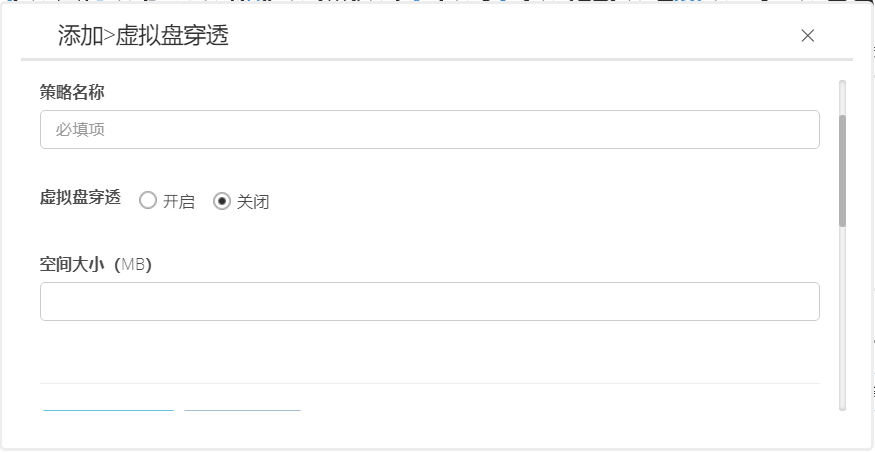

<blockquote class="info">
	什么是虚拟盘穿透
</blockquote> 

> 虚拟盘穿透是针对特定用户需求，将服务端指定目录下的文件穿透到策略中设置的客户端相应的虚拟磁盘中，实现服务端文件实时分发到客户端的目的。
 
 

 
1.  如何配置虚拟盘穿透策略

> 1. 首先安装虚拟盘穿透服务端程序，设置好服务端需要分发的文件路径；
 >  2. 配置虚拟盘穿透策略，设定客户端虚拟盘穿透路径；
>  3. 将需要分发的文件放入服务端指定路径中，即可实时同步；

 