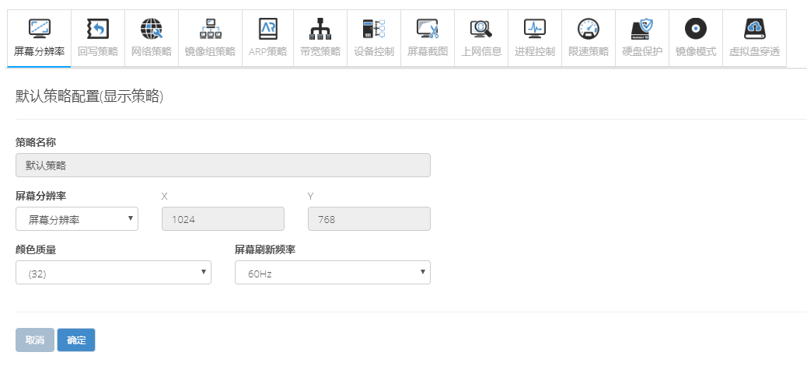
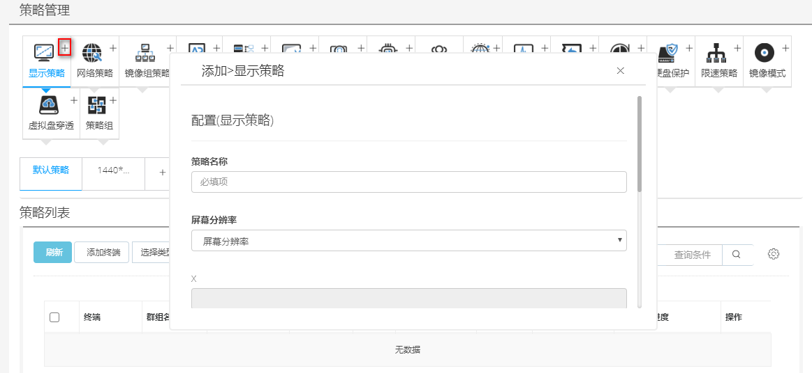

<blockquote class="info">
	 关于显示/屏幕分辨率策略
</blockquote> 

<blockquote class="success">
	显示策略是用于设置终端显示器屏幕分辨率、颜色质量与刷新频率；
</blockquote> 

1. 默认显示策略

2. 添加分辨率策略
<blockquote class="success">
根据显示器实际尺寸与分辨率可独立创建与之适应的屏幕分辨率， 创建完毕后将终端拖动至策略中即可实现显示策略调度，可以拖动设置正常分辨率也可以自定义设置特殊的分辨率，如下图；
</blockquote> 

3. 