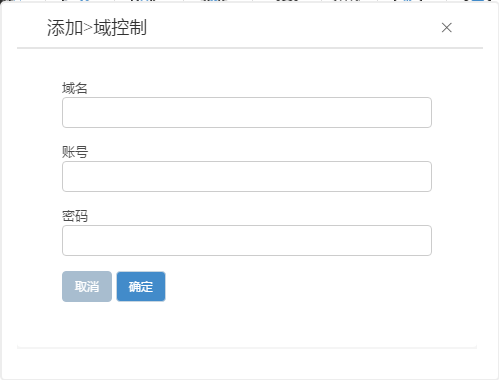

<blockquote class="info">
	什么是域控制
</blockquote> 

<blockquote class="success">
域控制策略是在域环境中通过部署域控管理员账户来完成终端客户机自动入域的功能；通过该功能，终端客户机可直接登录个人域账户而无需管理员入域操作；
</blockquote> 

* * * * * 
 
1.如何配置域控制
<blockquote class="success">
域控制策略是一个独立且专用策略，在默认策略中无此策略，如下图独立创建界面； 
</blockquote> 

 
   
<blockquote class="success">
域名即内网中域服务器名称 
添加域控具有管理员权限的账户； 
设置完毕后将终端客户机移动到策略中即可完成入域； 
注：创建域控制策略以后，将客户机首次添加到域控制策略或切换其他域策略时，客户机在添加进策略首次启动时需等待系统弹出入域成功的提示后，再次重启机器即可完成入域；
</blockquote>  

2. 如何入域

<blockquote class="info">
入域前提： 
    1）网络策略中需将第一个DNS设置为域服务器IP地址； 
    2）在添加域控制策略之前，请确认所添加域控制策略的账户为域控管理员账户，必须是域控管理员账户添加方可有效； 
    3）客户端在入域前需网络引导虚拟磁盘系统启动，并在超管模式下迁移系统SAM文件到本地硬盘分区或者同样设置为超管的数据盘中； 

</blockquote> 

 

<blockquote class="warning">
    完成上述操作后（如果是迁移到数据盘，需要设置数据盘为重启不还原状态），然后将客户端移动到域控制策略，客户机启动后即会提示入域成功，完成入域操作；
</blockquote> 