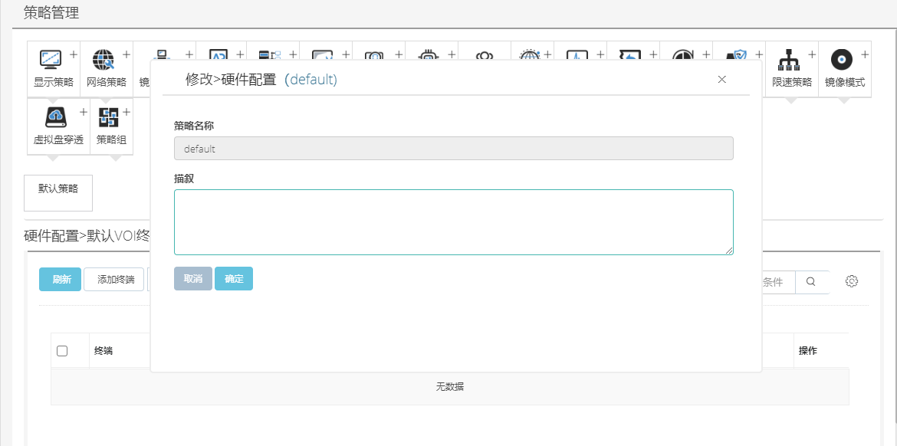

<blockquote class="info">
	什么是硬件配置
</blockquote> 

<blockquote class="success">
多硬件配置是用于差异硬件兼容管理的功能，可以将局域网里多种差异硬件兼容在同一镜像中，从而实现无需多个镜像来进行多种硬件的管理；
</blockquote> 

* * * * * 
  
1.修改硬件配置
如下图；硬件配置只能修改描叙信息
<blockquote class="success">
如图， 默认关闭
</blockquote> 

 
<blockquote class="warning">
注意：硬件策略需进入客户机设置，web不提供添加功能
</blockquote> 

  
2.如何创建硬件配置 
<blockquote class="success">
硬件配置的创建是在终端客户机操作，通过客户机在超级管理员权限下进行保存硬件配置后，控制台端将自动添加与之对应策略名称； 详细请查询客户端中如何保存硬件配置；在控制台可根据硬件配置进行描述一遍管理与查询； 
参考链接： 
如何保存多硬件配置 
如何创建多硬件配置 
</blockquote> 

  
3.如何删除硬件配置
<blockquote class="success">
硬件配置通常情况下无需删除，在更新新硬件以后，原硬件已经不存在或无使用，可删除硬件配置策略， 删除多硬件配置要满足以下2个条件： 
1.	要删除的多硬件配置下没有客户机； 
2.	超管在线且不在要删除的硬件配置下；
</blockquote> 