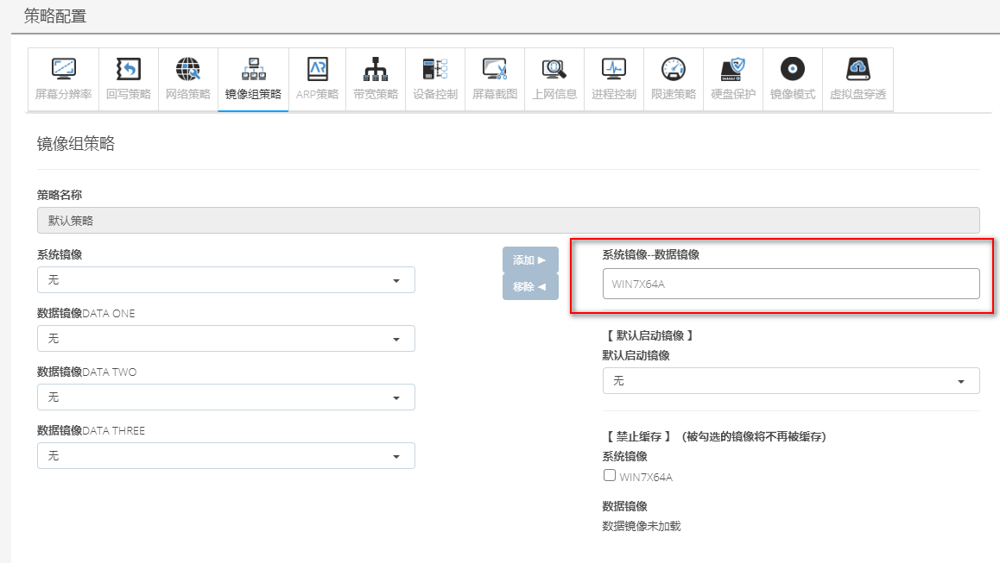
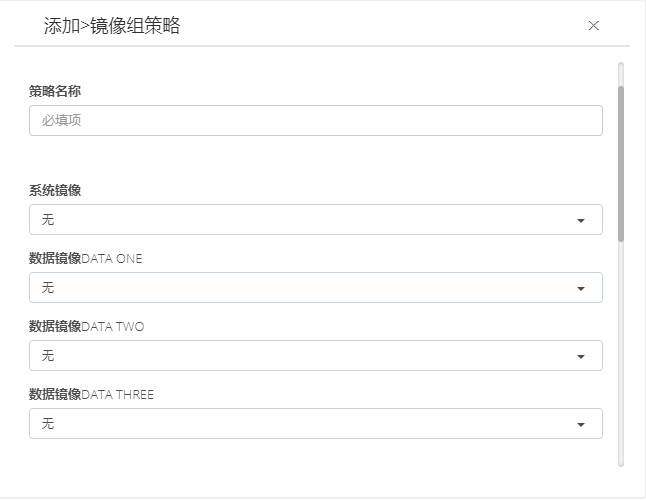

<blockquote class="info">
	 什么是镜像组策略
</blockquote> 

<blockquote class="success">
磁盘组策略是虚拟终端管理系统在同一网络用于管理多个操作系统并分配多个虚拟磁盘的策略； 
磁盘组策略可以同时为网络中分配windows XP系列、windows 2003 系列、windows 7系列等多种操作系统，为多元化操作系统在同一网络中的管理实现统一部署与配置；
</blockquote> 

* * * * * 

1. 默认镜像组策略

2. 添加镜像组策略
<blockquote class="success">
 磁盘组策略顾名思义即对磁盘进行分类归组，创建的镜像文件首先要配置默认磁盘组策略，每个磁盘组最多由一个系统镜像+三个数据镜像组成，系统镜像为必须选择，数据镜像可以根据实际使用情况选择是否添加，数据镜像可以同时和多个系统镜像配对使用，磁盘组列表下方可以勾选镜像是否允许缓存，默认为允许缓存，勾选为禁止缓存的镜像，客户机启动后不会将镜像文件缓存到本地硬盘上，如下图所示：

</blockquote> 

<blockquote class="warning">
注：每个磁盘组至少需要添加一个虚拟镜像，最多添加三个数据镜像，如果客户机需要使用多个虚拟系统，则需要在同一磁盘组策略中添加多个镜像对应关系。
</blockquote> 