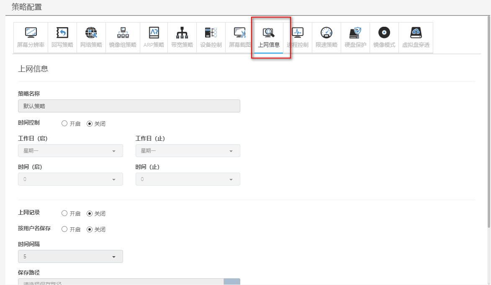
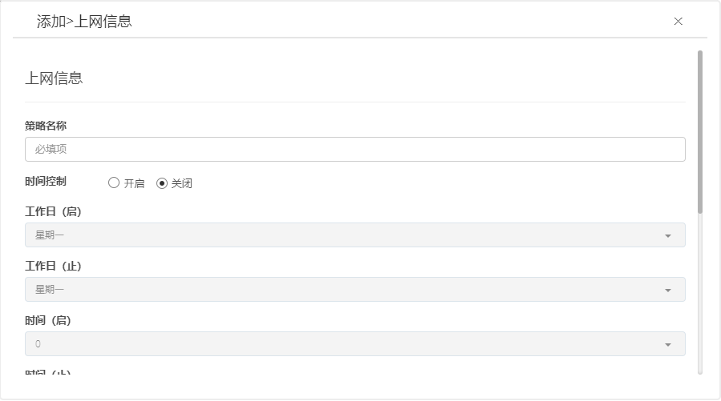

<blockquote class="info">
	上网信息配置
</blockquote> 

<blockquote class="success">
上网信息是用于记录终端IE浏览记录的功能，通过上网信息能查看终端60天以内的所有记录；
</blockquote> 

* * * * * 

1. 默认上网信息策略 
如下图:通过勾选[开启上网记录]开启功能，还需设置保存路径与时间间隔；

2. 添加上网信息策略
<blockquote class="success">
如图， 默认关闭
</blockquote> 

 
3. 查看上网信息
<blockquote class="warning"> 
    管理端：资源监控->上网信息中查看，如下图；
</blockquote> 

