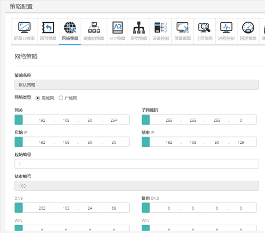
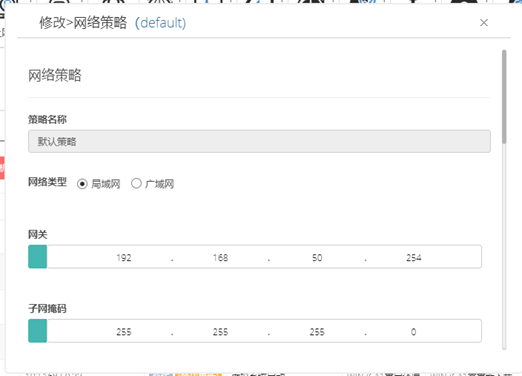

<blockquote class="info">
	 关于网络策略
</blockquote> 

<blockquote class="success">
	网络策略是用于设置虚拟终端系统网络中的网关、子网掩码、DNS以及IP地址池； 所有终端的网络详细信息都将遵循此策略中的信息； 所有终端的IP地址在该策略IP地址池范围中，反之即该策略中的所有网络参数即为终端网络参数；；
</blockquote> 

1. 默认网络策略

2. 添加网络策略
<blockquote class="success">
与显示策略相同，网络也可创建独立策略，即可创建与默认策略不同网关、DNS、WINS、IP段不同的网络参数； 
如下图为默认网络策略，IP段与服务端机器为同一网段，需先填写起始编号；； 
设置网络类型是将该网络策略设定为局域网环境或者广域网环境，根据设置网络类型不同，客户机启动后会自动连接服务器内网IP或者是映射到外网的IP， 
故部署在广域网环境中必须设置服务器的外网映射IP和端口，服务器映射设置详见 `服务器设置` 
右图为独立网络策略示意图；网络策略多用于同一网络中存在多个网关和跨网段情况，按实际需求创建网络策略后，将终端拖动至对应策略即可；

</blockquote> 

<blockquote class="warning">
注：终端在网络策略、回写策略这三个策略中调度时，终端必须为离线状态，调度后的策略将在下次重启生效，终端在线状态下无法进行该策略调度；
</blockquote> 