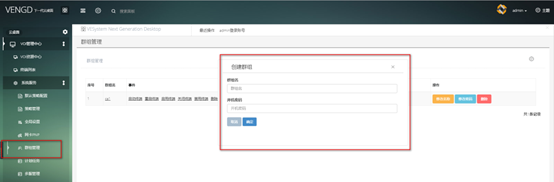
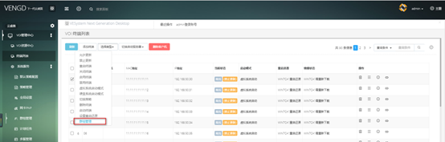

<blockquote class="info">
	什么群组管理
</blockquote> 

<blockquote class="success">
群组管理是用于来统一管理终端的策略，将需要统一配置策略和管理的终端移动到同一个群组中，可以在控制台中直接批量统一管理这些终端；
</blockquote> 

* * * * * 
 
1.创建群组管理策略：选择系统服务中的群组管理项，
<blockquote class="success">
点击右上角的创建群组，如下图； 
</blockquote> 

  
  
2.终端切换策略
<blockquote class="success">
在终端列表中勾选需要移动到同一群组策略中的客户机，选择终端列表下方的群组管理，如下图：
</blockquote> 

> 在弹出的界面中选择需要移动到的群组策略，完成终端的群组设置。
> 同一群组中的终端可以统一完成，重启，关机，切换策略，设置终端开机密码验证等操作，如下图：

<blockquote class="warning">
注：终端开机密码设置为空的情况下，该功能默认不生效；
</blockquote> 