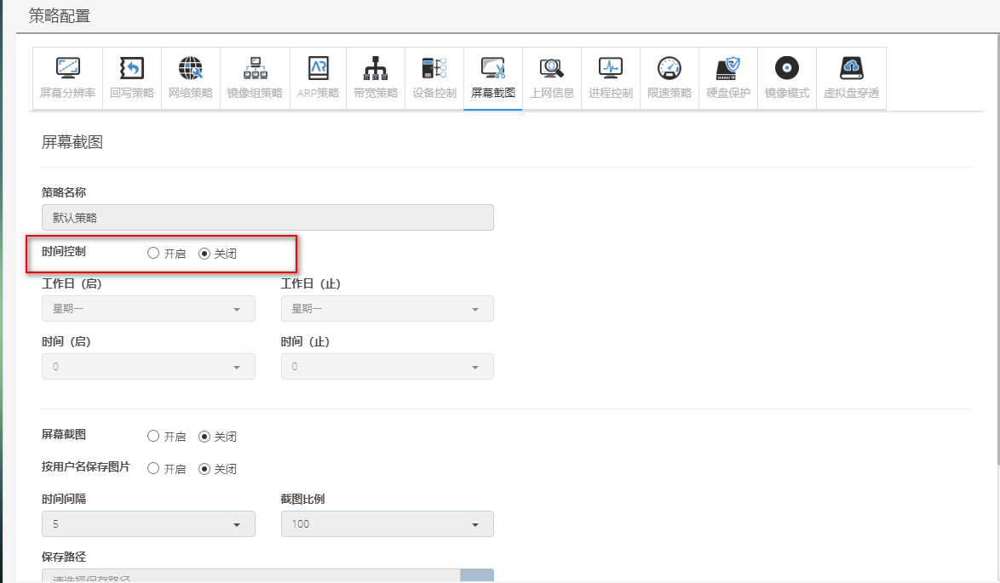
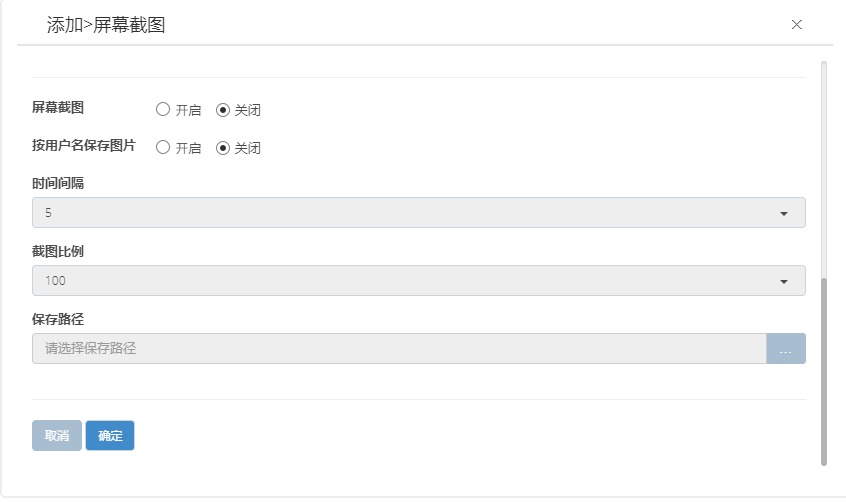
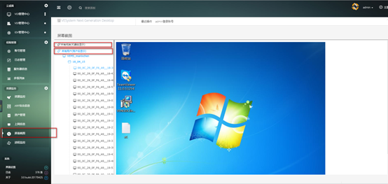

<blockquote class="info">
	什么是屏幕截图
</blockquote> 

<blockquote class="success">
屏幕截图是对终端桌面进行定时截图并发送到服务端，通过管理端控制台进行查看， 默认关闭，可在资源监控->屏幕截图中查看终端的屏幕截图
</blockquote> 

* * * * * 

1. 默认屏幕截图策略 
如下图；需勾选开启屏幕截图才能启动该策略，设置截图保存路径、时间间隔与图片比例；

2. 添加屏幕截图策略
<blockquote class="success">
如图， 默认关闭
</blockquote> 

 
3. 查看屏幕截图
<blockquote class="warning"> 
    管理端：资源监控->屏幕截图中查看，如下图；
</blockquote> 

