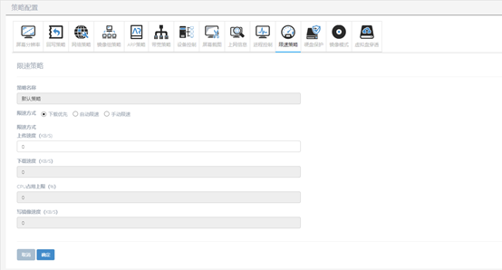

<blockquote class="info">
	什么是限速策略
</blockquote> 

> 限速策略是根据客户机实际使用需要，配置客户机的更新速度，可以设置下载优先，自动限速以及手动限速三种方式：

|类型|描叙|
|---|---|
|1）	下载优先|客户机以全速模式更新镜像，这个时候更新速度最快，但是可能会占用客户机过多的资源|
|2）	自动限速|该模式下系统会根据客户机的CPU使用率来自动限制客户机的更新速度，当客户机CPU使用率超过50%时，自动限速功能自动生效|
|3）	手动限速|该模式下可以根据实际情况手动配置客户机更新的具体参数，上传下载速度、CPU使用上限以及写磁盘速度都可以根据需要手动配置|
* * * * * 

 
1. 如何配置限速策略

> 系统默认是开启的下载优先模式，可以配置为自动限速或者手动限速模式，配置方法如下图所示：
> 

<blockquote class="warning">
    系统会根据配置的策略执行限速功能，当达到配置策略中某个参数时，限速策略即会生效；
</blockquote> 

2. 如何应用限速策略

> 1)	默认策略针对所有客户机进行管理，包含已存在客户机和新加入客户机，在无子策略情况下，所有客户机都受到默认策略的限制；
> 2)	新建策略针对所新建监控策略中包含的客户机，对己策略以外的客户机无限制；可根据实际情况对实际环境中的客户机进行区域管理；
 