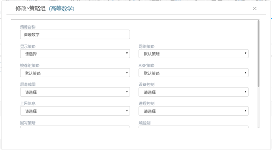

<blockquote class="info">
	什么是策略组
</blockquote> 

> 策略组是将多个策略集中到一个策略中，客户机移动到策略中，就会自动应用策略组中所有策略。
 
 

 
1. 如何配置策略组

> 在管理端右键选择策略组，新建策略组策略，选择需要统一配置的策略，如下图

<blockquote class="warning">
移动客户机到新建的策略组中会自动应用所有策略。
</blockquote> 
 

 