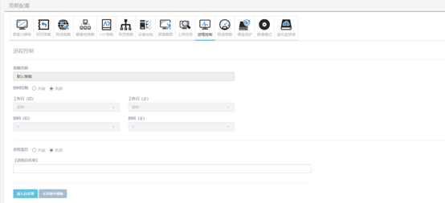

<blockquote class="info">
	什么是进程白名单
</blockquote> 

> 进程监控是对客户端操作系统监控应用程序状态的功能；在开启进程监控后，超级管理员与普通用户都无法在客户端操作系统上创建应用程序； 进程白名单，是在开启进程监控后，通过白名单列表中的进程名单来对客户端操作系统的应用程序进行许可安装；

* * * * * 
 
1.如何配置进程白名单
<blockquote class="success">
在进程监控策略中，通过勾选[开启进程监控]来打开进程监控功能，然后在下面的[添加]按钮来进行许可应用程序的进程添加；添加进列表后，客户端即可运行对应进程的应用程序；如下图；
</blockquote> 

<blockquote class="warning">
提示：在默认策略中开启进程监控与新建策略中开启进程监控权限一样，均视为开启全局进程监控；
</blockquote> 

 
2.如何应用进程监控
<blockquote class="success">
默认策略针对所有客户机进行管理，包含已存在客户机和新加入客户机，在无子策略情况下，所有客户机都受到默认策略的限制；
</blockquote> 
<blockquote class="success">
新建策略针对所新建监控策略中包含的客户机，对己策略以外的客户机无限制；可根据实际情况对实际环境中的客户机进行区域管理；
</blockquote> 

> 例：新建监控策略A与B两组策略；策略进行白名单分别是：A:word.exe； B:execl.exe ；
> 那么在策略A 与B下的客户机分别可以运行 word与execl 应用程序，两组策略下的客户机互不冲突；
