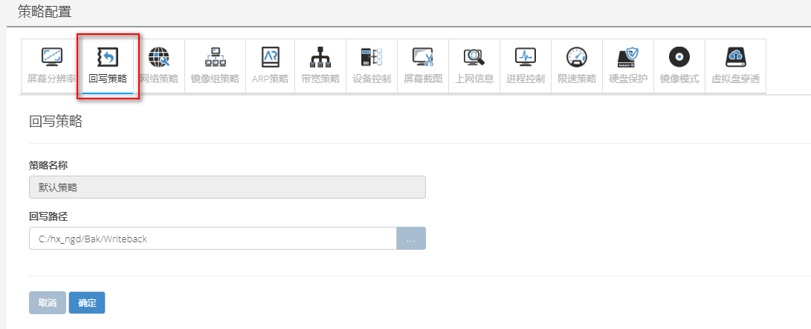
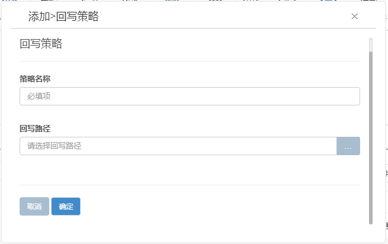

<blockquote class="info">
	关于回写策略
</blockquote> 

<blockquote class="success">
回写策略是调度终端虚拟操作系统在应用过程中产生的系统回写数据的存放路径；在虚拟操作系统中，存在重启不还原的数据磁盘，随着应用不断增加与时间的积累，回写文件会不断增大，而此时需要通过回写策略来调度不断增大的回写文件存放的回写路径；
</blockquote> 

* * * * * 

1. 默认回写策略

2. 添加回写策略
<blockquote class="success">
 在有独立存储或多物理磁盘的情况下，回写路径与镜像路径是不为同一路径；创建独立回写策略即重定向回写路径；创建完毕后将终端保持离线状态后直接拖入即可；如下图；

</blockquote> 

 