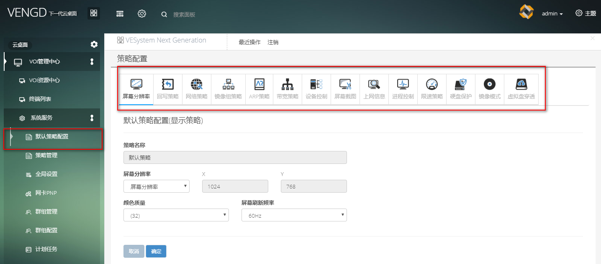

<blockquote class="info">
	 策略配置
</blockquote>  

>1) 配置默认策略 在VOI管理中心->系统服务->默认策略/策略管理均中可配置，
>
>2)添加/修改/删除策略  在VOI管理中心->系统服务->策略管理，

<blockquote class="danger">
	 默认策略不能删除
</blockquote>  
* * * * * 
<blockquote class="success">
	所有 策略
</blockquote>   
 
| 序号   |   策略 |有无默认策略|是否需要初始化|描叙|
| --- | --- | --- |--- |--- |
| 1| 屏幕分辨率策略 | 有|默认初始化|设置当前策略下终端屏幕分辨率、颜色质量以及屏幕刷新频率|
| 2| 网络策略 | 有  | 需初始化|允许当前网络策略内终端加入|
| 3| 镜像组策略配置 | 有  |需初始化|至少添加一个系统镜像|
| 4| 回写策略配置 |有   |需初始化| |
| 5| 设备控制配置 | 有  | 可选| |
| 6| 屏幕截图配置 | 有  |可选| |
| 7| 上网信息配置 | 有  |可选| |
| 8| 硬件配置管理 | 有  |可选| |
| 9| 群组管理配置 | 无  |无| |
| 10| 域控制配置  | 无   |无| |