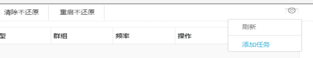
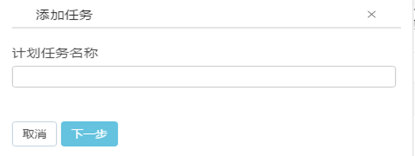
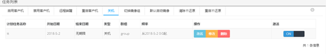

<blockquote class="success">
	 什么是 计划任务
</blockquote> 
 
>   计划任务是基于群组以及镜像组对所属的终端进行统一的，规律性的执行远程唤醒、关机、重启、禁用、启用、切换镜像组、重启不还原以及清除不还原数据的操作。其中，远程唤醒、关机、重启、禁用、启用以及切换镜像组是基于群组进行的操作；重启不还原以及清除不还原数据是基于镜像组进行的操作。

 
1. 如何配置计划任务

> 选择系统服务-计划任务，打开计划任务界面，点击添加计划任务按钮， 根据实际需要，选择任务类型、群组（镜像组）、任务执行频率、任务开始结束时间以及是否重复执行任务，任务配置完成后，系统就会根据任务的执行时间以及对应的群组（镜像组）来进行相应的操作。如下图：

2. 配置好基于群组的计划任务如下图所示

3.  