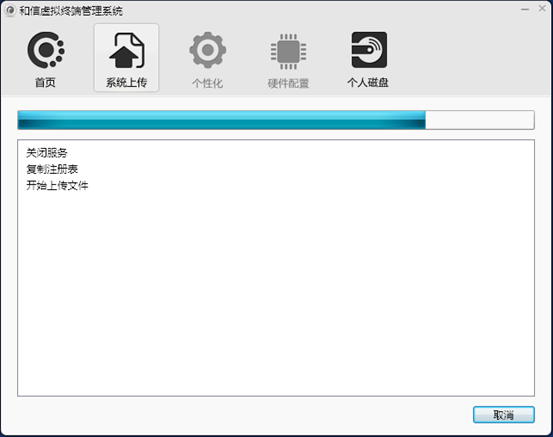

<blockquote class="info">
	上传操作系统镜像
</blockquote>

### 关于
> 上传操作系统镜像是将本地硬盘已经安装完毕的操作系统通过虚拟终端管理系统上传工具将系统上传到虚拟磁盘的操作；上传系统只有在超级管理员权限下才可以上传；
> 
<blockquote class="danger">
注： 建议虚拟操作系统中的安装可在上传系统后在进行安装； 
Linux操作系统下，重启终端后运行Vtools –upload命令上传系统；
</blockquote>

|步骤|操作|
|--|--|
|1、|通过上一章进入了本地操作系统以后，下一步将可以开始上传系统， 由于上传操作系统需超级管理员权限，所以在上传前我们需要将客户端设置为超级管理员，并且设置为硬盘启动； | 
|2、|客户机启动后点击系统右下角程序托盘图标，在弹出的操作界面中选择系统上传，系统磁盘与目标磁盘都自动选择，单击[上传系统]后，系统将开始进行操作系统上传，如下图；|  
|3、|上传完毕后单击[返回]并关闭机器，回到控制台中将机器启动模式切换为[网络启动]后重启客户端；至此，客户端由本地硬盘上传系统后网络启动操作完毕；| 
||<blockquote class="success">提示：上述操作是首台客户机启动，若需启动第二台或更多机器时，同样需要先将机器BIOS设置为网络引导； 在非首台客户机启动过程中，如非首台客户机的网卡与首台客户机相同情况下，则可直接启动，若不同，请参考第四部VENGD 系统服务端高级配置中的第十九章-网络PNP管理进行配置； 若除网卡不同以外，其他硬件均与首台客户机不同（例如：主板、显卡等），请参考第四部VENGD 系统服务端高级配置中的第九章-硬件配置管理；</blockquote>| 
|4、|客户机启动后选择分区缓存镜像数据的操作，详见服务端高级配置第二十一章；| 
||| 
||| 
