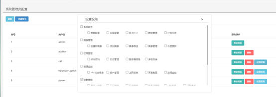

<blockquote class="info">
	什么是审计
</blockquote> 
 
> 审计是和信下一代云桌面系统面向用户不同需求进行管理与审查的功能，从安全审计级别上目前分为三个级别，包括（管理员、操作员与审计员）；

* * * * * 
 
1.  如何配置与管理审计
<blockquote class="success">
在WEB管理端点击[权限管理]，如图菜单，包含账号管理、日志管理与修改管理员密码功能；
</blockquote> 

账户级别分为三级：界面如下图
|类型|权限|
|---|---|
|管理员权限为最高|系统默认存在且只有一个|
|操作员权限为中级|可在管理员授权范围内对管理端进行操作，但不能查看日志|
|审计员权限为初级|只能查看管理端操作日志，不能进行任何界面操作|

2. 权限设置（如图）

