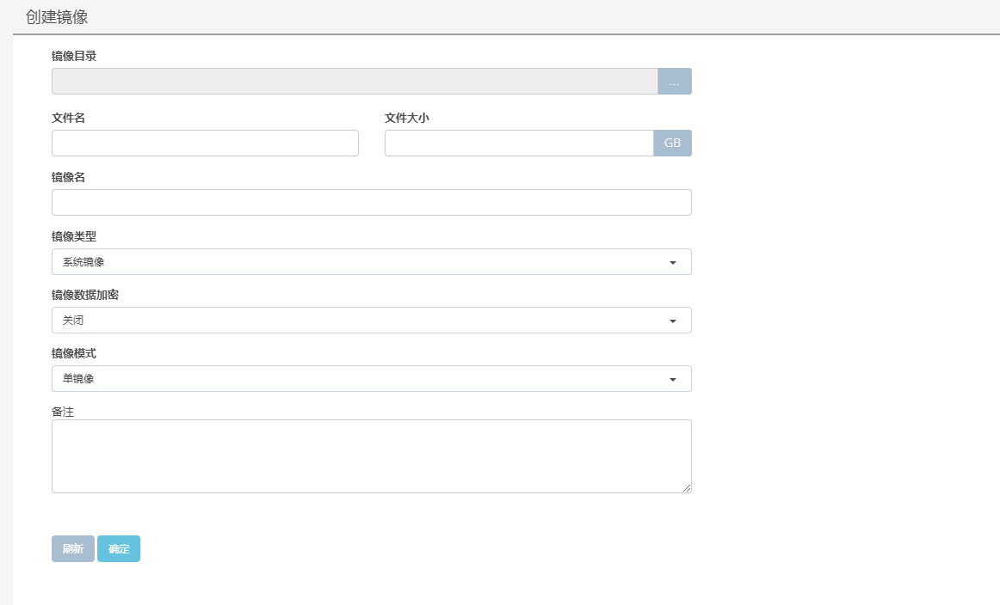
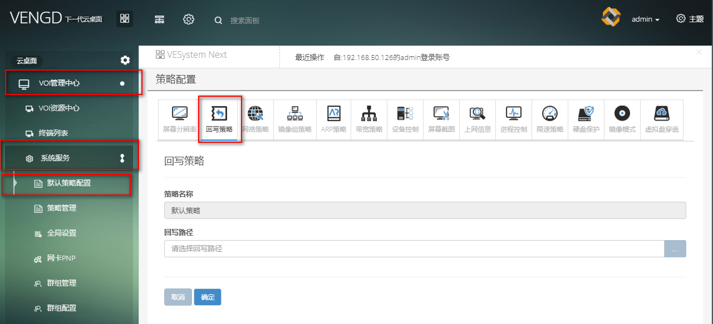
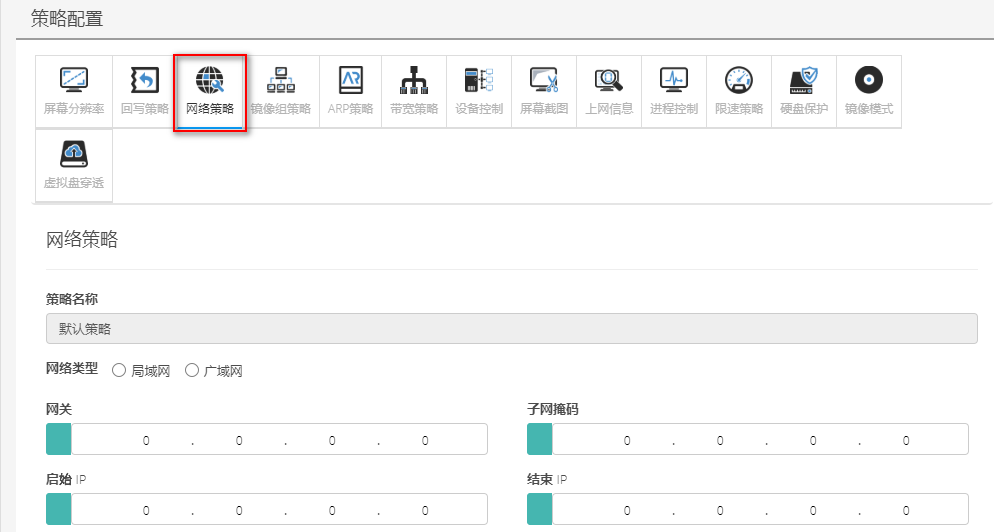
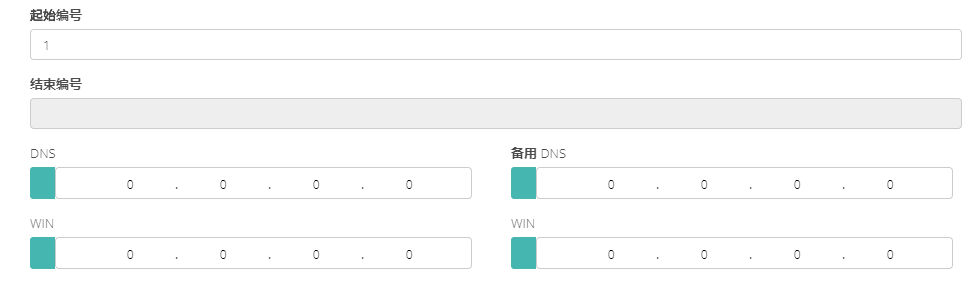
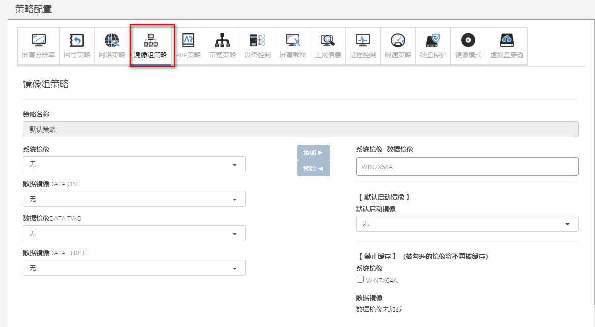
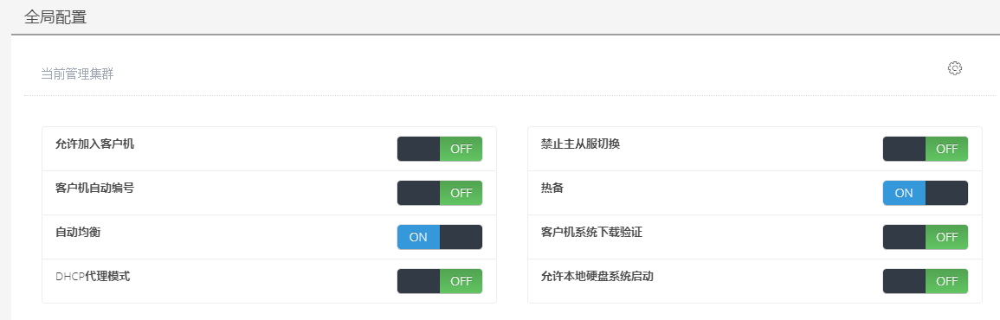

<blockquote class="info">
	 NGD管理端基础配置
</blockquote> 

* * * * *

#### VOI默认策略配置
| 步骤  |   操作 |
| --- | --- |
| 1、创建一个镜像文件 |需要首先在镜像管理中创建一个新的镜像文件，必须创建一个系统镜像， 数据镜像可以根据实际需要创建，镜像文件大小以及是否加密根据实际使用情况设定，如下图： |
|  | =800x) | 
| 2、全局还原点路径配置 |VOI管理中心->系统服务->全局设置：全局还原点路径，如下图： |
| --- ||
| 3、默认回写策略 |VOI管理中心->系统服务->默认策略配置:切换回写策略，设置回写策略路径 ，如图|
|  |  |
| 4、网络策略 | VOI管理中心->系统服务->默认策略配置:网络策略  <blockquote class="success">1）网关、子网掩码、起始IP、结束IP以及DNS必填， 2）、请填入正确网络策略，确保服务器能获取到默认策略中终端</blockquote> |
| --- |   |
| 5、镜像组策略 |  VOI管理中心->系统服务->默认策略配置:镜像组策略 <blockquote class="success">至少有一个系统镜像</blockquote> |
| --- | |
| VENGD Server端配置 |<blockquote class="success">1)服务端安装完毕重启后，在安装管理端即可连接服务端，服务端无需单独配置； 2)在多服务情况下，首次安装的服务端将默认为主服，其后安装都服务端都将为从服， 3)若要实现多服热备功能，需要在管理端界面的[系统]菜单中[全局策略]项开启[热备]选项， 4)如果需要实现多服务器负载均衡模式请再开启[自动均衡]选项即可；如下图</blockquote> |
| --- | |
| --- | |
| --- | | 
